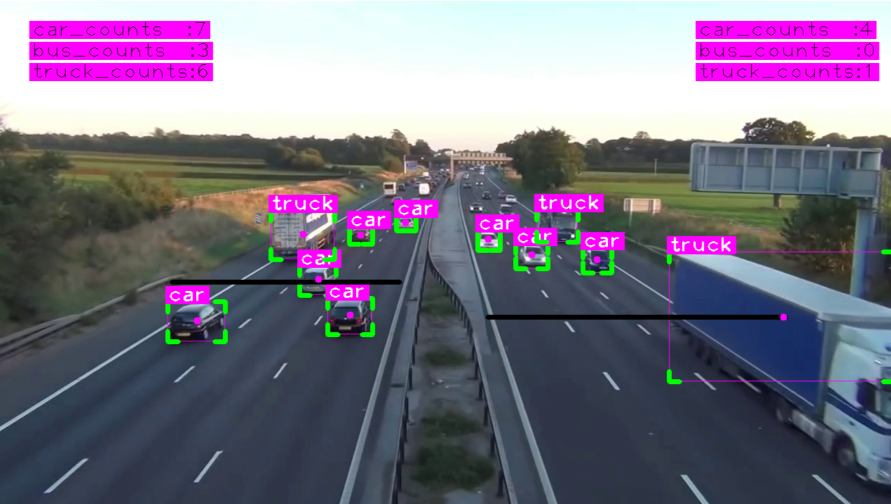
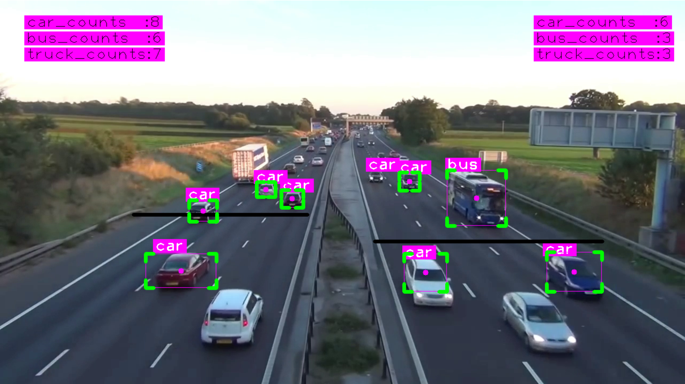

# Yolov8-Integrated-with-OpenCV-Vehicle-Detection-and-Counting
Vehicles Detection, Tracking and Counting using YOLOv8 and DeepSort

---

## Steps to run Code

- Clone the repository
```
git clone https://github.com/krishnavamshi21/Yolov8-Integrated-with-OpenCV-Vehicle-Detection-and-Counting.git
```
- Install the dependecies
```
pip install -r requirements.txt
```
- Go to the src folder
```
cd Yolov8-Integrated-with-OpenCV-Vehicle-Detection-and-Counting\src
```
- Run the code
```
python .\main.py
```
### RESULTS

<H4 align="center">
Vehicles Detection, Tracking and Counting </H4>




